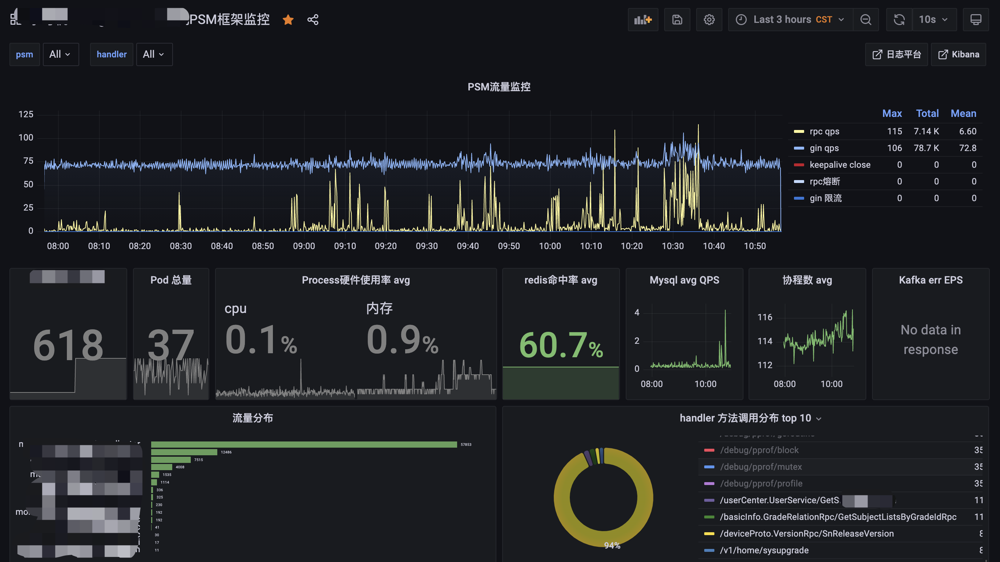
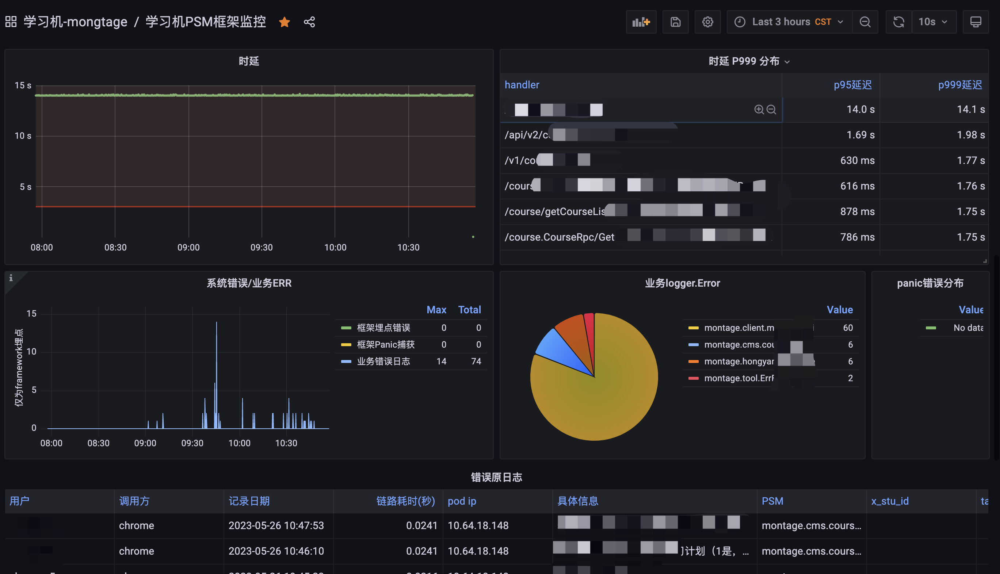
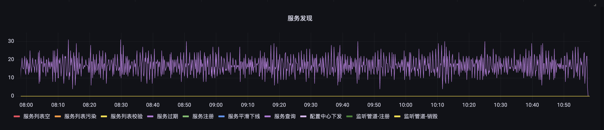

### 仓库

### 监控大盘




### 最近修复与更新

**最新framework 版本****v1.3.99, (升级时间 2.6)**

重大调整记录时间轴

v.13.89 重构kafka， serviceFound使用方式，参考用例； 新增api缓存

v1.3.73 压测发版

v1.3.64 优化监控服务聚合统计，新增 mysql qps （12.7）

v1.3.60 新增监控上报，grcpx.NewGrpcx方法重构 （12.5）

新增各类测试用例供查看使用

新增埋点gin、rpc执行时间

新增panic hook

v1.3.46 新增k8s signal平滑重启

租约时间调到10s

 

提醒：gin 调用 rpc 一定要加上 trasport 给 gin.ctx 做 转化（不影响gin.context本身），否则远程透传会失败！ 这块由于grpc不提供公有方法，没法hook！大家一定要加上，避免透传信息丢失， 形成规范，统一起来~  自定义透传参考标题 ：消息透传 

新增如下ctx转化，方便大家调用 


1. 最新版本修复多服务发现client 定时器纠错 报错的问题
2. arch.yml 移除 circuit 项，熔断器组、限流器组将全部由 tcm 进行开关推送
3. arhc.yml 新增psm， 移除冗余项，详情请看部门大群

**大家的proto尽量互相共享功能调用，避免重复开发微服务代码 (proto已经导出到公共仓库，大家都能访问，所以proto定义的方法尽可能复用)~**

在你的 go.mod 中需要加上3个 replace， 由于framework脱离了web框架的职责，封装了类似于kafka等工具套件，因此代码依赖间存在冲突做了一些纠错,  结合大家提供的错误信息，将各版本做了二分梳理，下述版本服务当前基础框架依赖， 请统一版本写在 go.mod 中(如果用到的话)

```plain
replace google.golang.org/grpc => google.golang.org/grpc v1.26.0
replace github.com/coreos/bbolt => go.etcd.io/bbolt v1.3.4
replace github.com/Shopify/sarama => github.com/Shopify/sarama v1.25.0
```

### go 基础配置规范

1. 控制好本地的 GOPATH
2. 引用包尽量不要使用相对路径，不同ide配置加载不好找path
3. 目录层次化，例如main启动文件放cmd下，编译结果放bin下
4. 配置目录层次化，例如首先建好 conf/local  conf/test  conf/online 来-dir 指定加载配置
5. idea 把  go fmt 和 go imports 都勾选上，消除idea一切黄色、红色标记
6. framework 快速迭代中， 大家go.mod 要控制好，可以参考 usage 汇总的 go.mod 写法
7. 一些版本问题在 go.mod replace，统一起来
8. 信息透传要用 pkg/httpclient 包发送http请求
9. 提交framework代码可以提交到新分支，由各组长merge确认
10. 对核心函数加上测试用例
11. 参考 compoent/plugin 使用自定义熔断器、限流器，配置tcm实现动态组件
12. http后端接口返回全部集成在  ginx/response 中， 框架会和客户端、前端对齐
13. 大家在配置文件中定义 log.projectName   grpc.basePath 统一采用 PSM 格式 
{产品线}.{子系统}.{模块}  P.S.M， 例如: montage.crm.test 一是为了避免服务名重复，二是为了后期能基于psm做追溯，服务间鉴权

14. 三端规范(后端、前端、客户端)，已拉会对齐，url(gin的router)， response 中的key 全部用 下划线不要用驼峰不要大小写，代码里定义的东西全部用驼峰，参考gin/response
15. gin返回错误消息要有准确的提示，不要把服务端语言返回给前端，例如 返回timeout， 用户是不知道什么意思，所以返回错误信息要描述准确，中文最好
### mod

```plain
module /framework_usage
go 1.16
replace google.golang.org/grpc => google.golang.org/grpc v1.26.0
replace github.com/coreos/bbolt => go.etcd.io/bbolt v1.3.4

require (
   /framework v1.1.2
)

注上述引用说明：
统一go版本 1.16+
及以上，建议1.16 (框架开发环境为1.16) 

grpc 版本统一为 v1.26.0

makefile 部分命令如下：
make db
make proto
make build
```

### 
```sql
使用grpc 先安装protoc代码生成工具 (由于grpc、etcdv3、protoc之间有版本问题，
所以咱们需要先挂vpn 安装 protoc-gen-go）

protoc命令安装方法：
1：本地电脑先挂vpn，保证电脑可以访问google。
2：保证本地go语言的版本不能高于1.17版本。若高于1.17版本，请先降级到1.16以下即可。
3：执行：go get github.com/golang/protobuf/protoc-gen-go@v1.3.2
4：mac电脑可以执行：brew install protobuf 
即可使用protoc命令编译proto文件。
```

### 
### grpcx 

GRPCX client 提供了 

```plain
cli, err := SRV1.GetConn()    获取的是长链接指针，万不可 cli.close()
如果close，在并发情况下一定会出现 close 或者 timeout 等问题， 千万注意！

cli, err := SRV1.GetNewDialConn()   获取的是一次性连接, 需要主动close
```
用户使用建议不defer close操作， 长链接性能更稳定
**框架内消息透传很重要，必须使用框架提供的 grpcx/transport（gin->rpc） 和 httpclient (gin->gin)两个包 （****调用rpc必须添加****）**

client 调用 grpc 也需要打包透传信息，否则日志不完整)

```plain
cc = transport.CtxToGRpcCtxWithField(cc, xxxx", b)  // 或 CtxToGRpcCtx
res, err := client.GetCache(cc, &proto.TestReq{Data: 1})
```
注意： 在grpc ctx 无需在 ctx 转化，已经集成到拦截器中，只需在 client 调用grpc服务时：
务必加上transport.CtxToGRpcCtxWithField 或 transport.CtxToGRpcCtx 进行 ctx 转化（因为client调用protoc生成的代码没有拦截器函数提供）

### 平滑重启

请务必升级到 v1.3.46+(加了信号监听功能，否则你的rpc只能等待租约失效才会摘除)


rpc 服务如果不采用平滑重启， 会对服务造成污染。

服务平滑重启有两种方式

1. 监听 k8s sigterm 信号，此部署方案不可用 supervisor 托管，否则信号不透传
2. 使用 prestop 这里脚本方式（不建议)
构建配置修改，删除配
保存，发布即可


### grpcx + ginx + logx

这里主要讲一下 grpcx + ginx  以及日志的工作方式

ginx 会通过 serverFound 函数寻找 rpc 服务ip地址进行dial （基于etcd）,交互操作

其已经实现上下文信息的透传

1: 全局默认透传， 如traceId, 版本号定义在 define 包下，所有业务字段可以统一于此

**调用ctx透传组内框架的实现业务代码，请务必使用 grpcx的 transport, 以及 httpclient**

2: 自定义透传，使用提供的 trasport 包实现自定义字段透传 (不加就会导致透传失败，造成日志缺省值缺失，当然http请求得用httpclient是一个道理，详情可以看代码去了解)

3：超时控制，在客户端对context设置超时，如下代码所示

例如一个 http handler 调用rpc如下

4：提供拦截器函数注入 (参考 grpcx_server 测试用例)

6：分页函数在 ginx/helper 中，统一分页参数为 page 和 page_size

7： 用例：跑起来 usage 下的 ginx_test 和 grpc_server 就可以访问

[http://127.0.0.1:8888/test/11](http://127.0.0.1:8888/test/11) 来跑通 服务了()

8： 本地请使用idea 的 debug调试，能下断点（idea调试配置不成功的可以找我一起解决）


### logx 日志的使用

日志使用 logx.L()

L()  接受 context 字段用于透传 

不同于网校的logger库， logx 底层采用的uber zap，其异步刷盘性能更优，压测效果更好

如果需要打印「默认」透传信息， 使用 logx.L(ctx) 即可

log 透传时支持计算每一次 log 距离首次web请求的 duration延时, 方便链路纠错

支持 tag打点、多k-v map打点 (T是tag， Ext是extra的意思)

logx.T(ctx, "tag")

logx.Ext(ctx, {"a":"b"})

**配置conf目录最好分为 conf/local  conf/test  conf/gray  conf/online 通过-dir 部署**

推荐大家配置如下：

**测试&本地debug**

```plain
log:
  level: debug   # debug info
  encoder: console  # json or console, 本地调试用 console 更美观， 线上环境请用json，可以和网关日志打通
  console: true     # 是否终端打印(否则直接刷盘)
  disabletags: true # 如果encoder是console，为了本地调试输出简洁好看，将其设置未true即可，线上环境请设置未false
  infofile: /tmp/info.log   # info 级别以上日志保存的地址
```
**灰度&线上环境**
```plain
log:
  level: info   # debug info
  encoder: json  # json or console, 本地调试用 console 更美观， 线上环境请用json，可以和网关日志打通
  console: false     # 是否终端打印(否则直接刷盘)
  disabletags: false # 如果encoder是console，为了本地调试输出简洁好看，将其设置未true即可，线上环境请设置未false
  infofile: /home/logs/xeslog/info.log  
```

### 消息透传(日志trace)

gin内部发起http属于内部http调用，要想实现trace透传，需要使用 httpclient 包将一些信息打包，实现框架内透传

gin->gin 用 httpclient

gin->rpc 用 trasport

```plain
ctx = transport.CtxToGRpcCtxWithOneField(ctx, "xxxx", "xxxx")
ctx = transport.CtxToGRpcCtxWithManyField(ctx, {"a":"b"})
ctx = transport.CtxToGRpcCtxWithAllField(gin.ctx)
```
然后再 rpc 服务中， 你就可以
ctx.Value(”xxxxx“)  拿到 

不用的话日志不全，拿traceid查不到链路日志不能怪我~~~ （protoc 生成的代码没法hook，否则就帮大家把这行代码加上了）

### tw-redis

支持；统一使用 tw-proxy 连接redis即可

### mysql

[https://yach-doc-shimo.zhiyinlou.com/sheets/tyVqQ3kthkky39xj/MODOC/](https://yach-doc-shimo.zhiyinlou.com/sheets/tyVqQ3kthkky39xj/MODOC/) <学习机后端资源申请成本预估>

支持；(可咨询 黄挥伟)

orm支持多sql客户端 (mysql 和 redis 已经支持多客户端，详情见 arch.yml 中的配置)

注： 统一使用软删除

for  instance (mysql先建表，再xorm-mac 自动生成 下述 .go model)

```plain
type User struct {
	Name      string    `xorm:"varchar(25) 'name'"`
	Id        int       `xorm:"pk 'id' autoincr"`
	Version   int       `xorm:"version"`
	UpdatedAt time.Time `xorm:"updated"`
	DeletedAt time.Time `xorm:"deleted"` 软删除
}
如果记录已经被标记为删除后，要真正的获得该条记录或者真正的删除该条记录，需要启用Unscoped()
```
[xorm-mac](https://yach-doc-shimo.zhiyinlou.com/uploader/f/vX3csoZrWk1vkkeA?fileGuid=GpW9c88v3gX9hjxq)

### tcm

支持；使用网校tcm的库，直接搬过来, 框架代码tcm包有测试用例

#### 一键熔断、限流、动态开关

如果需要启用此功能

需要项目中，在 arch.yml 配置好tcm

配置 你的psm同名（psm用途之一） tcm配置文件，当然tcm中的所属应用都要和你配置里定义的就行，这个不影响，但必须是psm同名配置项


如下示例，即可实现基于rpc函数动态熔断、

注意：

限流器针对 gin 的 uri

熔断器针对 rpc 的handler函数名（可以定义多个供业务自己使用也可以）

详情参考上述tcm配置

```plain
/*{
    "circuits":[
        {
            "name":"GetCache",  //rpc 函数名 或 自己定义业务名
            "timeout":100, // 超时控制ms
            "maxConcurrentRequests":100,  // 最大并发
            "requestVolumeThreshold":10, // 每10次作为一次统计滑动窗口，阈值自己控制
            "sleepWindow":300, // 如果熔断了，休眠300ms直接放回错误
            "errorPercentThreshold":50  // 错误率达到50%触发熔断
        }
    ],
    "limits":[
        {
            "path":"/test/11", // uri path
            "eps":1            // 单机最大限流
        }
    ]
   
    // switchers 开关
    // cache 缓存
}*/
// the err must be set here otherwise the client will never get the information
errX := circuit.GetBreakerSet().Monitor(path, f1, f2)
```

#### 【新增】 接口级缓存 

考虑到数据层api 如getList，rpcGetList 等，一些变化不大的基本数据可以设置缓存；

因此，框架层介入进行缓存配置；

只需配置 tcm cache 字段 {"path":"/test/11", "duration": 10} 即可配置该接口 10s 的内存缓存；

缓存的结果是第一次的 返回 的 body 内容。因此可以减少handler压力。


### response

和客户端、前端对接完成了，由gin的放回包都按照下属格式： 参考 ginx/response


code 只有三种状态 0, 1, 2

不按照格式可能会和前端产生不必要麻烦


### Kafka


消费者参考  framework/component/dispatch/ 测试用例


### 签名

签名算法要求统一

提供ecc jwt两种签名算法

### 插件

提供 limiter 限流插件、 

提供 selector 轮询，随机等选择插件 （详情见plugin）

提供熔断器开关功能 

注意： 熔断、限流器均定义在 tcm 中！不要硬编码配置

提供分布式锁 

提供分布式id生成算法

提供pod leader选举

提供内部定时器开发框架

限流： 从源头限起（从gin侧）

熔断： 从微服务函数熔断（grpc侧）

考虑到性能和稳定性上， 采用但节点配置 + 动态推送配置

### 监控

~~promethus 打点监控，~~

~~架构组维护 专用打点的promclient， 以及 grafana~~

和中台商讨监控方案，为了业务更好使用metric

 [https://yach-doc-shimo.zhiyinlou.com/docs/913JVny14Os5xJ3E/](https://yach-doc-shimo.zhiyinlou.com/docs/913JVny14Os5xJ3E/) <学习机监控metric方案>

这个待补充，和数据平台沟通方案中

监控确认采用日志tag/map 的方式使用数据平台的 es 做查询、 clickhouse 做时序，大家用好logx库就可以很好的输出metric指标， logx.T

升级版本，框架原生支持qps打点

[https://app.xxx.com/grafana/d/hOmEpYD4z/xue-xi-ji-ye-wu-kuang-jia-jian-kong?orgId=1&from=now-1h&to=now&refresh=5s](https://app.xxx.com/grafana/d/hOmEpYD4z/xue-xi-ji-ye-wu-kuang-jia-jian-kong?orgId=1&from=now-1h&to=now&refresh=5s)  账号密码 guest/guests


新增日志监控服务提供 诸如 redis 命中率 监


### 调试&测试

go version  >= 1.16 （推荐1.16框架开发版本）

调试测试用例请指定 -dir 绝对路径/相对路径


### 配置加载

arch.yml

必须定义 arch.yml 框架文件（同名）， 框架会自动根据 configmanager 加载基础配置，业务需要按照格式填写自己的 端口、数据库、log配置等（arch文件示例如下，除了参数，配置字段不可更改），如果不需要使用响应模块，可以不填，但不要引用即可（例如：代码没有grpc模块， 留空即可，但不能再调用 grpcx，参考usage online 配置 ）

业务要想自己定义其它 xxx.yml ， 在目录下建立 ，使用

confutil.LoadYmlFile 函数， 加载到你的结构体上即可，注意是和 -dir 同一个目录


### 编译

必须定义 arch.yml

设置 gopath mod 等配置本地环境，调试

项目里使用cmd目录做main函数加载未知，目录结构参考

编译：

全部定义在 Makefile 中， 看 make build

以下的目录方式更清晰


### k8s部署

选择应用组

发布配置参考下述测试用例

参考[https://cloud.xxx.com/k8s-fe/appManage/appManageCenter/detail?id=16293](https://cloud.xxx.com/k8s-fe/appManage/appManageCenter/detail?id=16293)

```plain
export GOPROXY=https://goproxy.cn,http://mirrors.xxx.com/repository/go
```

### 日志采集

接入framework框架的代码日志采集全部打到同一个 index 中，具体配置参考 (统一业务日志规范、监控)

[https://cloud.xxx.com/k8s-fe/appManage/appManageCenter/detail?id=16374](https://cloud.xxx.com/k8s-fe/appManage/appManageCenter/detail?id=16374)

### 
### 配置信息

本地(网校idc搭建的和bcc-test不通)

etcd: 10.90.72.58:2379, 10.90.72.94:2379, 10.90.72.135:2379

测试etcd：（本地不能用该地址）

bcc-test-montage-etcd-headless.etcd.svc.cluster.local:2379

 

### Http util配置

```plain
http:
  needLog: true
  transport:
    maxIdleConns: 500
    maxIdleConnsPerHost: 100
    idleConnTimeout: 10
    httpVersion: "HTTP/1.1"
```
使用http util请求，needLog=true时输出http请求参数，返回体，默认不输出
可配置transport参数，httpVersion可选HTTP/2.0，HTTP/1.1


### errorx错误处理

新增errorx包，实现error

可以使用AddCustomerErrors()\AddCustomerError()方法添加自定义异常：

```plain
AddCustomerErrors(map[int]string{
   1: "异常1",
   2: "异常2",
})
```
可以使用：WrapWithRetMsg()\WrapWithCodeRetMsg()方法包装异常：
```plain
err := errors.New("unmarshal error")

err = WrapWithRetMsg(err, "返回1")
err = WrapWithCodeRetMsg(err, 1,"返回2")
```
在gin返回异常时，会判断异常类型，并返回异常信息：


如果异常为MError类型，返回MError内定义的异常信息

如果不是MError类型，有传入msg信息，返回msg内容，否则默认”服务错误“

